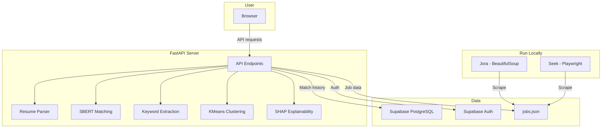

# Job Matcher — Resume-to-Job Matching Platform

A backend + ML web application that scrapes live job listings from Seek and Jora, then matches them against user resumes using SBERT semantic similarity and keyword extraction across 16 industries.

Users can upload their resume to:
- See how well they match specific jobs with explainable scoring
- Identify skill gaps and prioritise what to learn next
- Discover their best-fit role based on current market data
- Track skill demand trends across different fields and locations

**ML Pipeline:** SBERT (all-MiniLM-L6-v2) for semantic matching, regex-based keyword extraction, KMeans clustering for role recommendation, and permutation-based SHAP for score explainability.

**Backend:** FastAPI REST API with 9 endpoints, Supabase authentication, PostgreSQL database, and automated job scraping using BeautifulSoup and Playwright.

**Deployment:** Dockerised and deployed on HuggingFace Spaces. SBERT model pre-downloaded during build to optimise container startup time within free-tier resource constraints.

**Acknowledgement:** AI tools (Claude) were used for guided learning, debugging support, and code review throughout development. All code was written and understood by the developer.

## Live Demo

- **API Documentation:** [Swagger UI](https://tommy279-job-matcher.hf.space/docs)
- **Frontend:** In development

## Tech Stack

| Layer | Technology |
|-------|-----------|
| Language | Python |
| API Framework | FastAPI |
| ML/NLP | SBERT (sentence-transformers), scikit-learn, KMeans |
| Scraping | BeautifulSoup, Playwright |
| Database | PostgreSQL (Supabase) |
| Auth | Supabase Auth (JWT) |
| Resume Parsing | pdfminer.six |
| Deployment | Docker, HuggingFace Spaces |
| Version Control | Git, GitHub |

## Features

- **Resume Matching** — Upload your resume and get a match score against any job listing, with explainable scoring showing which skills impact your score the most

- **Skill Gap Analysis** — See exactly which skills you have and which you're missing for any role

- **Market Demand** — View the most in-demand skills for any role and location, based on live job data

- **Best-Fit Role** — Discover which role suits you best based on your resume, powered by KMeans clustering

- **JD Highlight** — View job descriptions with your matched skills highlighted in green and missing skills in red

- **Match History** — Track all your previous matches and scores over time

- **Authentication** — Secure register and login system with Supabase Auth

## API Endpoints

| Method | Endpoint | Description |
|--------|----------|-------------|
| GET | `/` | Health check |
| GET | `/api/jobs` | Get job listings with keyword and location filtering |
| POST | `/api/match` | Upload resume + select job → get match score |
| POST | `/api/auth/register` | Create a new account |
| POST | `/api/auth/login` | Log in and receive JWT token |
| GET | `/api/match/history` | View past match results |
| GET | `/api/market-demand` | Most in-demand skills for a role |
| GET | `/api/best-fit` | Best-fit role based on resume |
| GET | `/api/jd-highlight` | Job description with skills highlighted |

## Architecture



## How to Run Locally

**Prerequisites:** Python 3.14+, Git

**1. Clone the repo:**
```bash
git clone https://github.com/NhatAnh279/job-matcher.git
cd job-matcher/backend
```

**2. Install dependencies:**
```bash
pip install -r requirements.txt
```

**3. Set up environment variables:**

Create a `.env` file in `backend/`:
```
SUPABASE_URL=your_supabase_url
SUPABASE_KEY=your_supabase_anon_key
```

**4. Run the server:**
```bash
uvicorn app.main:app --reload
```

**5. Open Swagger UI:**

Visit `http://localhost:8000/docs`

## Project Structure

```
backend/
├── app/
│   ├── main.py                  # FastAPI server + endpoints
│   ├── api/
│   │   └── auth.py              # Supabase authentication
│   ├── ml/
│   │   ├── extractor.py         # Skills dictionary + keyword extraction
│   │   ├── matcher.py           # SBERT matching + SHAP explainability
│   │   ├── best_fit.py          # KMeans clustering for role recommendation
│   │   └── resume_parser.py     # PDF text extraction
│   ├── scraper/
│   │   ├── jora.py              # Jora scraper (BeautifulSoup)
│   │   ├── seek.py              # Seek scraper (Playwright)
│   │   └── run_scraper.py       # Combined scraper runner
│   └── data/
│       └── jobs.json            # Scraped job listings
├── requirements.txt
├── Dockerfile
└── .env                         # Environment variables (not in repo)
```
